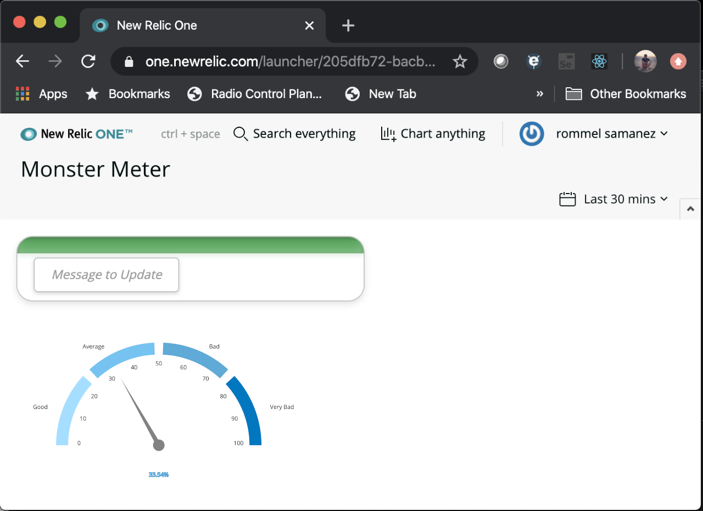
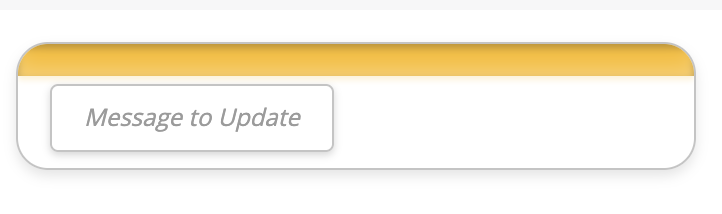
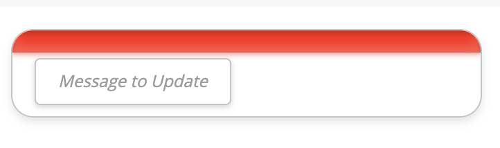
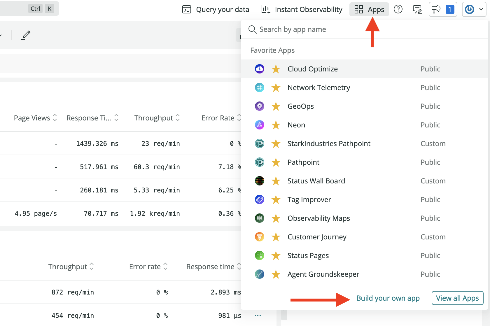
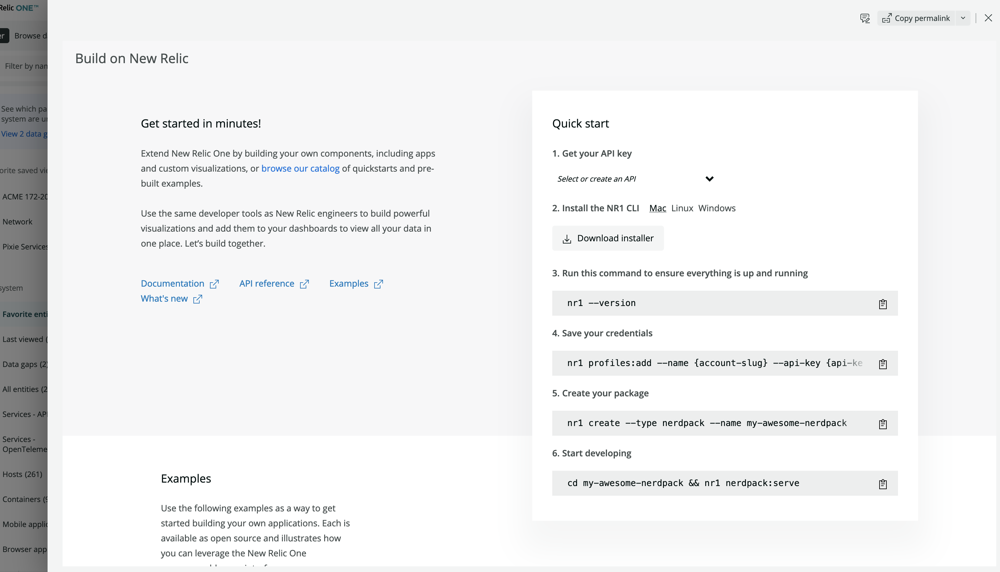

# Evaluación nr1 Developer

La evaluación consiste en hacer un Nerdpack o también conocida como "New Relic One Application" y consta de 2 partes.

## 1ra Parte:

Que es un Nerdpack? pues es el nombre que le puso New Relic a las aplicaciones basadas en ReactJS que se pueden hacer dentro de su plataforma llamada [New Relic One](https://developer.newrelic.com/explore-docs/nerdpack-file-structure/).

La aplicación es muy sencilla, solo es hacer una caja usando estilos que tiene 3 estados: verde,amarillo y rojo como muestro en las imágenes, los estados deben cambiar automáticamente cada 2 segundos.

Luego Crear un Componente llamado "Odometer" como se muestra en la imagen que reciba un valor entre 0 y 100 y muestre el valor y cambie la posición de la aguja según corresponda.   
Sugerencia: crear el componente utilizando graficos SVG.

Se debe poder ingresar el numero [0 - 100] en el campo "Message to Update" y luego de presionar la tecla ENTER se debe actualizar el valor en el ODOMETER creado.

En esta etapa es muy importante el tema de los estilos, se busca obtener un tema visual lo mas parecido al mostrado en la imagen.

 
Como puedes ver, un Nerdpack es una aplicación embebida dentro de New Relic One. Para ello tienes que crearte una cuenta en [New Relic](https://newrelic.com), es gratuita, y luego crear el Nerdpack, también llamado "New Relic One Application" dentro de New Relic.

Ingresas y luego vas a [New Relic One](http://one.newrelic.com) y seleccionas la opción "Build your own application" allí esta la documentación y los pasos a seguir para crear una nueva aplicación.

Puedes encontrar documentación [aqui](https://docs.newrelic.com/docs/new-relic-one/use-new-relic-one/build-new-relic-one/new-relic-one-build-your-own-custom-new-relic-one-application)
Parte del objetivo de la evaluación es tu capacidad para investigar.   

Finalmente, envianos un [correo](mailto:rsamanez@wigilabs.com) con el link del repositorio donde hayas alojado tu código fuente para que lo podamos descargar y evaluar.
   
## 2da Parte:
El objetivo de esta parte es hacer un analisis de la aplicacion que esta en el siguiente proyecto [aplicacion_prueba](https://github.com/GlobalsoftWigilabs/prueba_pp).   

Esta es una aplicacion que fue mal diseñada, parte del problema es el consumo de memoria que va creciendo.    
- Cuales crees que son las deficiencias que tiene la aplicacion?
- Que mejoras propones?
- Donde crees que se cometieron los errores?   

Tu respuesta la puedes enviar al siguiente [correo](mailto:rsamanez@wigilabs.com)

