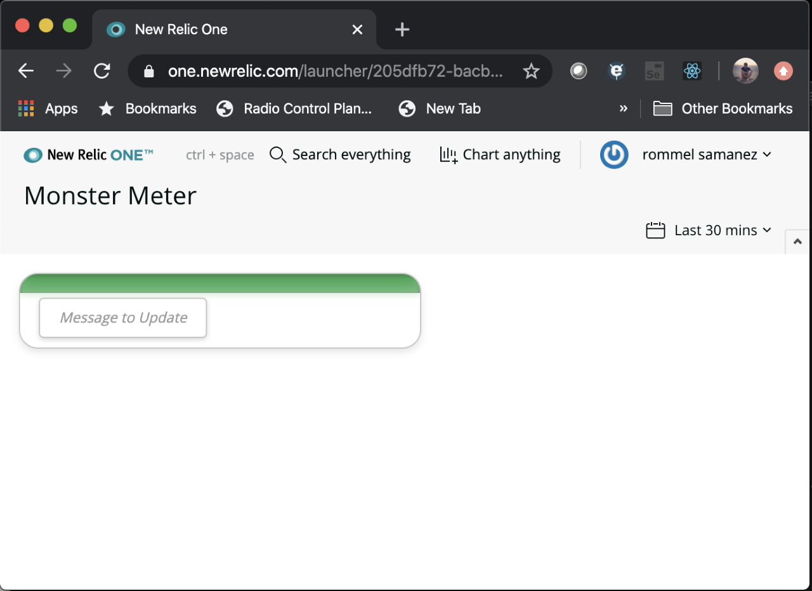
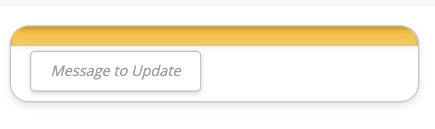
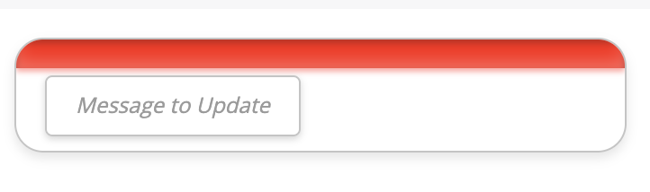
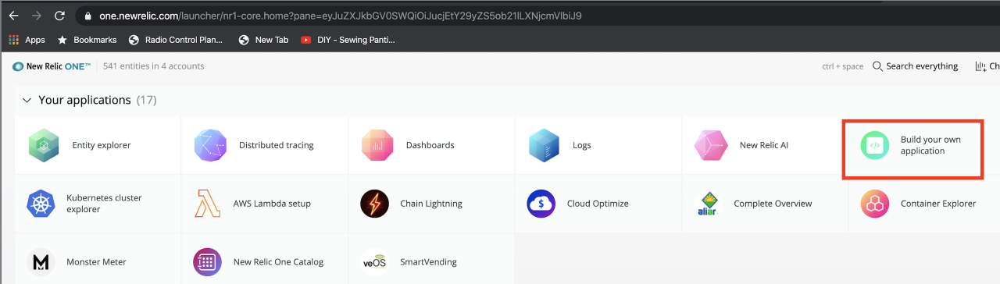
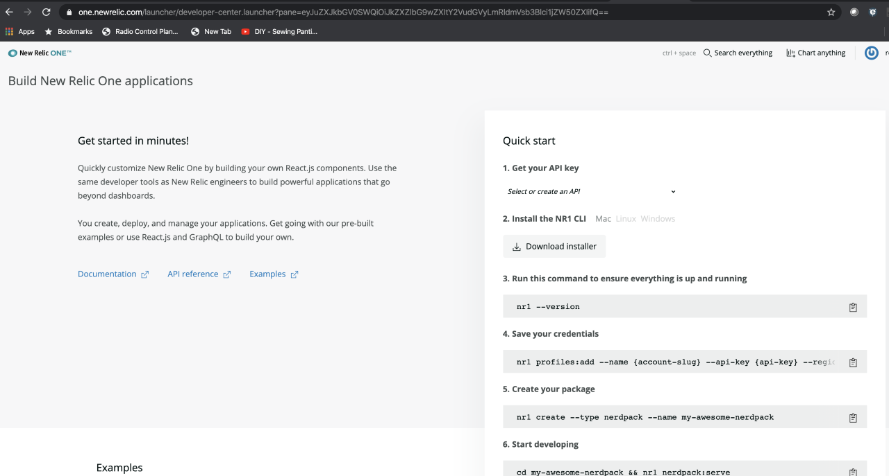
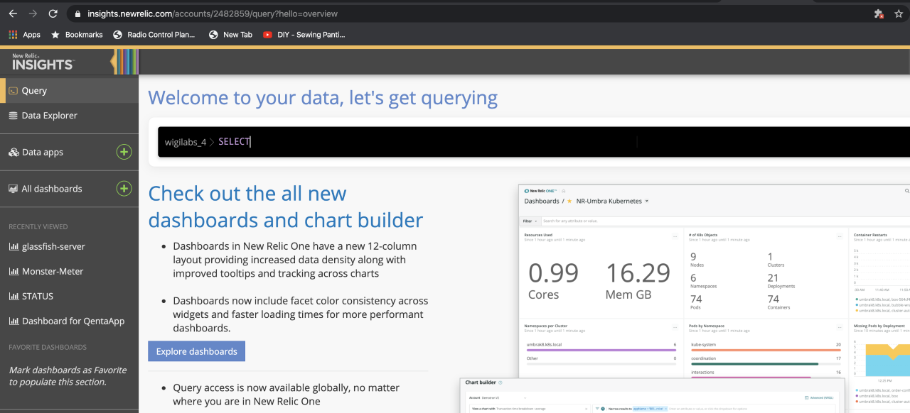
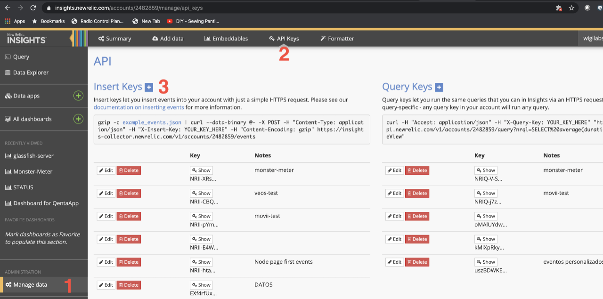

# Evaluación nr1 Developer

La evaluación consiste en hacer un NerdLet o también conocida como "New Relic One Application" y consta de 2 partes.

## 1ra Parte:

Que es un Nerdlet? pues es el nombre que le puso New Relic a las aplicaciones basadas en ReactJS que se pueden hacer dentro de su plataforma llamada [New Relic One](https://docs.newrelic.com/docs/new-relic-one/use-new-relic-one/build-new-relic-one/new-relic-one-application-nerdpack-file-structure).

La aplicación es muy sencilla, solo es hacer una caja usando estilos que tiene 3 estados: verde,amarillo y rojo como muestro en las imágenes, los estados deben cambiar automáticamente cada 2 segundos.

En esta etapa es muy importante el tema de los estilos, se busca obtener un tema visual lo mas parecido al mostrado en la imagen.

 
Como puedes ver, un Nerdlet es una aplicación embebida dentro de New Relic One. Para ello tienes que crearte una cuenta en [New Relic](https://newrelic.com), es gratuita, y luego crear el Nerdlet, también llamado "New Relic One Application" dentro de New Relic.

Ingresas y luego vas a [New Relic One](http://one.newrelic.com) y seleccionas la opción "Build your own application" allí esta la documentación y los pasos a seguir para crear una nueva aplicación.

Puedes encontrar documentación [aqui](https://docs.newrelic.com/docs/new-relic-one/use-new-relic-one/build-new-relic-one/new-relic-one-build-your-own-custom-new-relic-one-application)

> Luego el segundo paso, es Actualizar el mensaje: "Message to Update" que aparece en la caja de la aplicación que hiciste.

> Esto es un poco mas elaborado, y si consideras que te es muy complejo lo puedes dejar pasar. Depende de ti si solo haces la primera parte o continuas con la segunda. Ten en cuenta que el tiempo que demores para hacer el trabajo también es Importante.

> Puedes entregar el trabajo en 2 partes.

## 2da Parte:

El objetivo es actualizar el mensaje usando el **NRQL** que es la base de datos que usa NewRelic, para ello tienes que entender que es INSIGHTS que es una de las herramientas que tiene NewRelic. porque el objetivo es insertar un nuevo mensaje a esa base de datos y luego el Nerdlet tiene que actualizar el mensaje leyendo el nuevo valor desde la base de datos de newrelic.

Para actualizar el mensaje en la base de datos se usa un API de Insights
 

Parte del objetivo de la evaluación es tu capacidad para investigar.

Ten presente que también se va evaluar la calidad y limpieza de tu código.

Finalmente, envianos un [correo](mailto:rsamanez@wigilabs.com) con el link del repositorio donde hayas alojado tu código fuente para que lo podamos descargar y evaluar. 